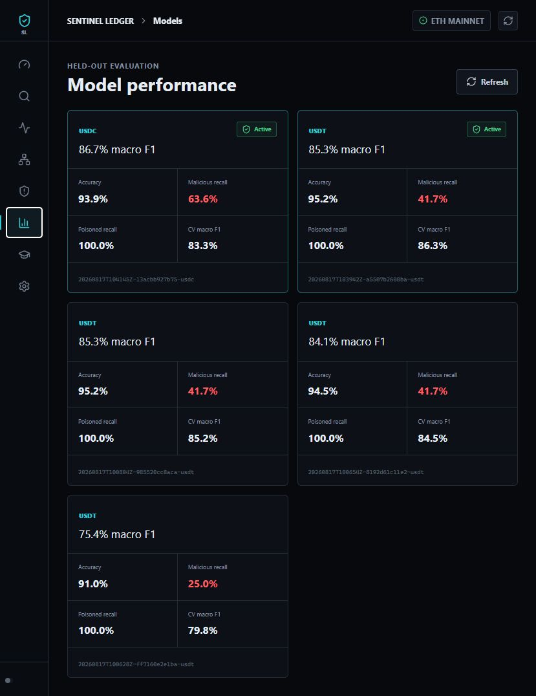
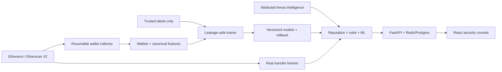

# Stablecoin Payout Risk Intelligence


Real-time, pre-payout wallet intelligence for Ethereum stablecoins. The system combines real Etherscan/provider events, behavioral rules, versioned machine learning, and transaction-graph context into **ALLOW / REVIEW / BLOCK** decisions.

**Created and maintained with credit to John Marwin Ebona.**



## System At A Glance



| Capability | Shipped behavior |
|---|---|
| Collection | Select 1 to 1,000,000 wallets, six stablecoins, seeds, breadth, and history depth; every job checkpoints and resumes. |
| Live alerts | Uses provider WebSockets or real Etherscan transfer logs. No synthetic alert fallback is emitted. |
| Threat intelligence | Screens attributed local feeds, optional Etherscan metadata/public warnings, and optional Chainabuse before behavioral ML. |
| Training | Wallet-deduplicated 70/15/15 splits, train-only preprocessing, 5-fold CV, RF/XGBoost/LightGBM comparison, optional 0-200 Optuna trials. |
| Versions | Every successful run creates immutable artifacts, metrics, an active pointer, and one-click rollback. |
| Operations | Wallet investigation, live stream, network graph, cases, model analytics, collection/training jobs, and settings. |
| Backend | API-key hashing, configurable rate limiting/CORS, Redis TTL cache, Postgres feature storage, SQLite alert/case store, JSON logs, Prometheus metrics. |

## Run Locally

```powershell
python -m venv .venv
.\.venv\Scripts\Activate.ps1
pip install -r requirements-dev.txt
cd frontend
npm install
cd ..
Copy-Item .env.example .env
python scripts\start_local.py
```

Add at least one real source to your untracked `.env`:

```env
ETHERSCAN_API_KEY=your_key
# or ALCHEMY_WS_URL / INFURA_WS_URL / ETH_RPC_WS_URL
```

- Checker and command center: **http://127.0.0.1:5173/**
- Local collection and training: **http://127.0.0.1:5173/training.html**
- API explorer: **http://127.0.0.1:8000/docs**
- Metrics: **http://127.0.0.1:8000/metrics**

The live screen shows `offline` when no provider/key is configured. It never fills the table with demo incidents.

## Safety Behavior

An explicit provider reputation match blocks before behavioral scoring. If chain history cannot be fetched, or no usable evidence exists, the result is **REVIEW / UNSCORABLE** and probabilities display as `not calculated`; missing data is never presented as `Normal 0%`.

The training page can sync Etherscan's current Gas Guzzlers table, but imports only rows carrying an explicit phishing/scam label. High gas usage alone is not treated as malicious. For licensed feeds and provider options, see [threat_intel/README.md](threat_intel/README.md).

## Large Collection And Training

The GUI defaults to 50,000 wallets and accepts up to 1,000,000. The same workflows are scriptable:

```powershell
python scripts\collect_wallets.py --target 50000 --tokens USDT USDC
python scripts\train_models.py --token usdt --model auto --tuning-trials 50
python scripts\evaluate_model.py --token usdt
```

Collected neighbors are stored with label `-1`. They can enrich a dataset, but supervised training uses only independently trusted labels `0/1/2`; network proximity is not silently converted into a fraud label.

## Honest Model Results

Latest local 50-trial runs on the repository's historical labeled data:

| Token | Test accuracy | Macro F1 | Malicious recall | Poisoned recall | Target |
|---|---:|---:|---:|---:|---|
| USDT | 95.17% | 85.31% | 41.67% | 100.00% | Not met |
| USDC | 93.94% | 86.73% | 63.64% | 100.00% | Not met |

Accuracy is high because safe wallets dominate. Neither model meets the project's stricter requirement of 0.90 macro F1 plus 0.90 recall for both fraud classes, so these models support investigation and review rather than unattended blocking. See the generated [USDT report](docs/model_performance/usdt_report.md) and [USDC report](docs/model_performance/usdc_report.md).

DAI, BUSD, USDP, and TUSD remain training-blocked when their trusted data lacks a class or has fewer than ten examples in the smallest class. The trainer reports that limitation instead of manufacturing a score.

## Deployment

```powershell
docker compose up --build
```

This starts FastAPI, PostgreSQL, and Redis. The React package can be deployed from `frontend/` to Netlify. Netlify serves the read-only console; collection and training stay locked there and require the local API with `ENABLE_LOCAL_TRAINING=true`. Set `VITE_API_BASE_URL` to a separately hosted FastAPI URL when building a connected static console.

## Documentation

- [Architecture](docs/ARCHITECTURE.md)
- [Feature reference](docs/FEATURES.md)
- [Deep-model boundary](docs/DEEP_MODELS.md)
- [Full ecosystem and every file](technical.txt)
- [Implementation log](IMPLEMENTATION_LOG.md)
- [Security audit](AUDIT.md)
- [Original engineering build specification](docs/AGENT_BUILD_PROMPT.md)

## Security

Secrets belong only in `.env`; `.env.example` contains placeholders. Consumer API keys are stored as SHA-256 hashes through `API_KEYS_SHA256`. CI and pre-commit run `detect-secrets`.

Earlier commits exposed credentials. Current code no longer contains them, but provider-side credential rotation and a coordinated Git history rewrite are still required before treating the repository history as clean. See [AUDIT.md](AUDIT.md).

## License And Credit

No license file is currently included, so normal copyright restrictions apply. Project credit: **John Marwin Ebona**.
