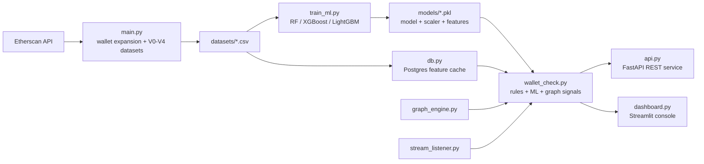
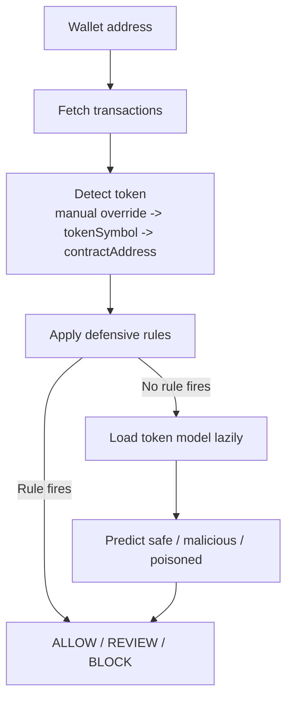

# Real-Time Stablecoin Payout Risk Scoring System


Pre-transaction wallet intelligence for stablecoin and token payouts. The system combines Etherscan-derived transaction features, token-aware rules, machine-learning models, and wallet graph analysis into a real-time decision engine.

**Credit:** John Marwin Ebona

---

## What It Does

| Layer | Purpose |
| --- | --- |
| Dataset engine | Expands wallet pools and generates V0-V4 labeled CSV datasets from Etherscan transaction data. |
| ML training | Trains per-token RandomForest, XGBoost, and LightGBM models for USDT, USDC, DAI, BUSD, USDP, and TUSD. |
| Runtime scoring | Scores wallets with rule-based checks first, then ML inference when a trained model exists. |
| Graph intelligence | Builds wallet transaction graphs with degree, PageRank, centrality, clusters, and malicious-neighbor signals. |
| API layer | Serves wallet scoring, batch scoring, model info, and health checks through FastAPI. |
| Web UI | Includes static `checker.html`, `training.html`, and `index.html` pages for local or static hosting. |
| Live stream | Provides a WebSocket listener skeleton plus `/ws/live-alerts` for the checker UI. |

---

## Visual Flow





---

## Token Coverage

| Group | Status | Tokens |
| --- | --- | --- |
| Trained stablecoins | Full ML scoring | USDT, USDC, DAI, BUSD, USDP, TUSD |
| Watch-only tokens | Detection and rule fallback | FRAX, USDX, GUSD, LUSD, MIM, USDD, EURS, DOLA, GOHM, USDCE, ALUSD, cUSDT, AAVE, COMP, SNX, UNI, LINK, SUSHI, CRV, 1INCH, YFI, MKR, BAL, AURA, WETH, MATIC, LDO, ARB, OP, GMX, SOL, MANTLE, LINEA, WBTC, cBTC, stETH, rswETH, CBETH, LST, cbRES, swETH, DOGE, SHIB, PEPE, FLOKI, BONK, WLD, SAFE, ETH |

---

## Repository Map

| Path | Role |
| --- | --- |
| `main.py` | Dataset generation, wallet expansion, feature extraction, V0-V4 pipelines. |
| `train_ml.py` | Multi-model training, token-specific weights, model/scaler export. |
| `wallet_check.py` | Runtime wallet scoring, token detection, rules, lazy model loading. |
| `api.py` | FastAPI service for scoring and system metadata. |
| `dashboard.py` | Streamlit dashboard for wallet scoring, charts, and system views. |
| `graph_engine.py` | NetworkX graph metrics and suspicious-cluster analysis. |
| `gnn_model.py` | Optional PyTorch Geometric GNN experiments. |
| `deep_model.py` | Optional TensorFlow/PyTorch sequence-model experiments. |
| `stream_listener.py` | Alchemy/Infura WebSocket listener and alert callback shell. |
| `db.py` | Postgres-backed feature and label cache. |
| `scan_and_report.py` | Quick dataset/model inventory helper. |
| `model_tester.py` | Simple model-load sanity script. |
| `technical.txt` | Full ecosystem explanation, file-by-file connections, and current caveats. |
| `index.html` | Static local project overview for browser preview. |
| `checker.html` | Static wallet checker that can call a local or deployed FastAPI backend. |
| `training.html` | Local-only training console for API-triggered training runs and rollbacks. |

---

## Quick Start

```bash
python -m venv .venv
.venv\Scripts\activate
pip install -r requirements.txt
```

Create `.env` from your own local values:

```env
ETHERSCAN_API_KEY=your_etherscan_api_key_here
DATABASE_URL=your_postgres_connection_string_here
ALCHEMY_WS_URL=wss://your-provider-websocket-url-here
```

Run the API:

```bash
python api.py
```

Open:

- API docs: `http://localhost:8000/docs`
- Health check: `http://localhost:8000/health`
- Static overview/checker/training: run `python -m http.server 8080`, then open `http://localhost:8080/`

Score a wallet from Python:

```python
from wallet_check import score_wallet

result = score_wallet("0x0000000000000000000000000000000000000000", manual_token="USDT")
print(result)
```

---

## Decision Logic

| Output | Meaning |
| --- | --- |
| `ALLOW` | No rule/model signal crossed the risk threshold. |
| `REVIEW` | Suspicious behavior exists, but the wallet needs human review before blocking. |
| `BLOCK` | High-confidence malicious or poisoned behavior was detected. |

Current runtime flow:

1. Fetch Etherscan transactions for a wallet.
2. Detect token by manual override, token symbol, or known contract address.
3. Generate behavioral and graph-aware features.
4. Run defensive rules for obvious risky patterns.
5. If no rule decides, load the token model on demand.
6. Return probabilities, confidence, graph fields, reason, and final decision.

---

## Important Current Notes

- Active Etherscan key configuration now reads from environment variables. Previously exposed keys still need rotation and Git history scrubbing.
- Some historical data/model artifacts are committed even though `.gitignore` excludes generated CSV and pickle files.
- `train_ml.py` now splits before fitting scalers and oversampling; performance claims still need fresh generated reports.
- `gnn_model.py` is optional and imports safely without PyTorch, but GNN training still requires PyTorch and PyTorch Geometric.
- Local training is disabled unless the API runs with `ENABLE_LOCAL_TRAINING=true`.

See `technical.txt` for the detailed system ecosystem, exact file relationships, and remediation notes.

---

## Local Preview

This repo includes a lightweight static preview:

```bash
python -m http.server 8080
```

Then visit `http://localhost:8080/`.

Static pages:

- Checker: `http://localhost:8080/checker.html`
- Local training: `http://localhost:8080/training.html`

---

## Credits

Built and credited to **John Marwin Ebona**.

Visual README elements use standard GitHub Markdown diagrams and Shields-style badge images.
